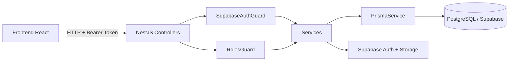
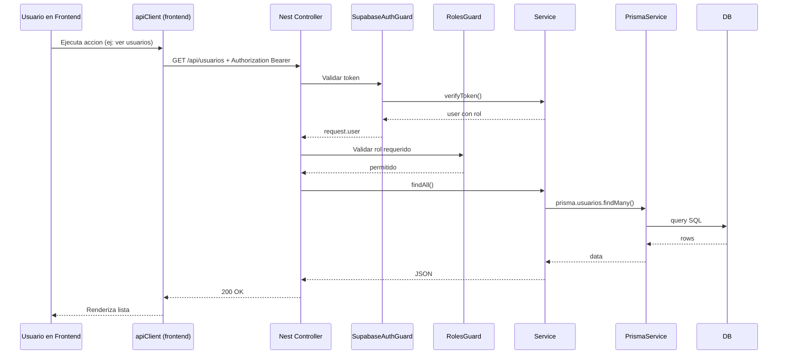

# Guia de arquitectura, endpoints e integracion Front-Back

## 1) Objetivo de esta guia

Esta guia explica, paso a paso, como funciona la arquitectura actual del proyecto y como agregar nuevos endpoints de forma segura y consistente.

Esta escrita para personas que:

- Nunca han trabajado con NestJS o Prisma.
- Nunca han conectado un frontend React con un backend protegido por token.
- Necesitan entender el flujo completo desde UI hasta base de datos.

---

## 2) Panorama general del proyecto

El proyecto esta dividido en dos aplicaciones principales:

- Backend: API REST con NestJS, Prisma y autenticacion basada en Supabase.
- Frontend: SPA en React + Vite que consume la API con un cliente HTTP centralizado.

Estructura de alto nivel:

- proyecto_integrador/backend
- proyecto_integrador/frontend
- proyecto_integrador/docs

---

## 3) Arquitectura en capas (backend)

En backend, la arquitectura sigue este flujo:

1. Controller: recibe HTTP request y valida datos de entrada basicos.
2. Guard: valida autenticacion y autorizacion por rol.
3. Service: contiene reglas de negocio.
4. PrismaService: acceso a PostgreSQL via Prisma.
5. Respuesta JSON: se devuelve al frontend.

### UML de componentes (alto nivel)



### UML de secuencia (request protegido)



---

## 4) Arquitectura en frontend

El frontend centraliza consumo API y autenticacion para evitar repetir logica:

- services/api.ts: cliente HTTP con interceptor y refresh de token.
- contexts/AuthContext.tsx: estado global de sesion, login, logout, refresh.
- hooks/useApi.ts: hooks reutilizables para GET y mutaciones.
- componentes: llaman apiClient o hooks y renderizan UI.

Flujo resumido en frontend:

1. Usuario inicia sesion.
2. Se guardan access_token y refresh_token en localStorage.
3. Cada request agrega Authorization Bearer.
4. Si API responde 401, se intenta refresh token automaticamente.
5. Si refresh falla, se limpia sesion y usuario debe reautenticar.

---

## 5) Configuracion inicial (desde cero)

## 5.1 Requisitos

- Node.js 20+ recomendado.
- pnpm instalado globalmente.
- Proyecto Supabase con Auth y DB PostgreSQL.

## 5.2 Variables de entorno

Backend usa:

- DATABASE_URL
- DIRECT_URL
- SUPABASE_URL
- SUPABASE_ANON_KEY
- SUPABASE_SERVICE_KEY (opcional pero recomendado para operaciones admin)
- PORT
- CORS_ORIGIN

Frontend usa:

- VITE_API_URL

### Pasos

1. Copiar backend/.env.example a backend/.env.
2. Copiar frontend/.env.example a frontend/.env.
3. Ajustar valores reales.

## 5.3 Instalacion y ejecucion

Desde backend:

```bash
pnpm install
pnpm run start:dev
```

Desde frontend:

```bash
pnpm install
pnpm run dev
```

Si todo esta correcto:

- API corre en http://localhost:3000
- Front corre en http://localhost:5173

---

## 6) Endpoints actuales (resumen funcional)

### Auth (publico por decorador)

Base path: /api/auth

- POST /login
- POST /logout
- POST /refresh-token
- POST /forgot-password
- POST /reset-password
- POST /verify-token
- PUT /change-password
- GET /validate-session

### Usuarios

Base path: /api/usuarios

- POST /
- GET /
- GET /:id
- PATCH /:id
- PATCH /:id/password
- PATCH /:id/foto-perfil
- POST /:id/foto-perfil/upload
- DELETE /:id

### Departamentos

Base path: /api/departamentos

- GET /

### Activos

Base path: /api/activos

- GET /

---

## 7) Como agregar un endpoint nuevo (proceso profesional)

Este es el proceso recomendado para evitar regresiones.

## 7.1 Pseudoalgoritmo general

```text
INICIO
1. Definir problema de negocio y resultado esperado.
2. Definir contrato API:
   - Metodo HTTP
   - Ruta
   - Input (body, params, query)
   - Output (shape JSON)
   - Errores esperados (400, 401, 403, 404, 409, 500)
3. Definir seguridad:
   - Publico o protegido
   - Si protegido: roles permitidos
4. Implementar endpoint en Controller.
5. Implementar logica en Service.
6. Si hay DB:
   - Actualizar Prisma schema SOLO si cambia modelo
   - Ejecutar migracion
   - Actualizar query Prisma en Service
7. Probar endpoint con cliente API (Bruno/curl).
8. Integrar endpoint en frontend:
   - agregar llamada en apiClient o usar apiClient directo
   - integrar en componente/hook
   - manejar loading y errores
9. Validar flujo end-to-end (UI -> API -> DB -> UI).
10. Documentar endpoint y decisiones.
FIN
```

## 7.2 Comandos utiles para scaffolding NestJS

Desde proyecto_integrador/backend:

```bash
# Crear modulo, controller y service
pnpm nest g module reportes
pnpm nest g controller reportes --no-spec
pnpm nest g service reportes --no-spec

# Alternativa: crear recurso completo (CRUD base)
pnpm nest g resource reportes --no-spec
```

Nota: si usas resource, revisa y adapta codigo para mantener consistencia con el estilo del proyecto.

## 7.3 Si cambias modelo de base de datos

```bash
# Editar prisma/schema.prisma
# Luego:
pnpm prisma generate
pnpm prisma migrate dev --name nombre_del_cambio
```

---

## 8) Ejemplo completo: crear endpoint GET /api/activos/:id

Objetivo: obtener detalle de un activo por id.

## 8.1 Backend: Controller

Archivo: backend/src/activos/activos.controller.ts

Agregar metodo:

```ts
@Get(':id')
findOne(@Param('id', new ParseUUIDPipe()) id: string) {
  return this.activosService.findOne(id);
}
```

## 8.2 Backend: Service

Archivo: backend/src/activos/activos.service.ts

Agregar metodo:

```ts
async findOne(id: string) {
  const activo = await this.prisma.activos.findUnique({
    where: { id },
    select: {
      id: true,
      nombre: true,
      codigo_etiqueta: true,
      foto_principal_url: true,
      created_at: true,
      categorias: { select: { nombre: true } },
      estados_activo: { select: { nombre: true } },
      usuarios: {
        select: {
          id: true,
          nombres: true,
          apellido_paterno: true,
          apellido_materno: true,
        },
      },
    },
  });

  if (!activo) {
    throw new NotFoundException('Activo no encontrado');
  }

  return activo;
}
```

## 8.3 Prueba rapida con curl

```bash
curl -X GET http://localhost:3000/api/activos/<UUID> \
  -H "Authorization: Bearer <ACCESS_TOKEN>"
```

## 8.4 Frontend: consumo

Ejemplo directo en componente:

```ts
const detalle = await apiClient.get(`/api/activos/${activoId}`);
setActivo(detalle);
```

Ejemplo con hook reusable:

```ts
const { data, isLoading, error, execute } = useApiGet(
  `/api/activos/${activoId}`,
);
useEffect(() => {
  execute();
}, [execute]);
```

---

## 9) Integracion Front-Back: checklist

Antes de cerrar una tarea de endpoint, revisar:

- Ruta y metodo HTTP coinciden en backend y frontend.
- Path incluye prefijo /api en frontend.
- Endpoint protegido recibe Bearer token.
- Guard y roles definidos correctamente.
- CORS_ORIGIN permite el host del frontend.
- Error handling muestra mensaje util en UI.
- Si hay upload, usar FormData y no Content-Type manual.
- Si hay cambio de schema, migracion aplicada y cliente Prisma regenerado.

---

## 10) Consideraciones importantes (calidad y seguridad)

## 10.1 Seguridad

- No exponer endpoints sensibles como publicos.
- Definir Roles() en rutas administrativas.
- Validar input de forma estricta.
- No filtrar detalles internos en errores 500.

## 10.2 Consistencia de datos

- Mantener reglas de negocio en Service, no en Controller.
- Usar select explicitos en Prisma para no exponer campos de mas.
- Usar transacciones cuando haya multiples escrituras dependientes.

## 10.3 Performance

- Evitar devolver tablas completas sin paginacion cuando crezcan.
- Seleccionar solo campos necesarios.
- Evitar llamadas duplicadas desde frontend.

## 10.4 Observabilidad minima recomendada

- Loguear errores importantes con contexto de endpoint.
- Tener trazabilidad de quien hizo cambios (usuario/rol/request).

---

## 11) Flujo de trabajo recomendado para equipo

1. Crear rama por feature.
2. Implementar endpoint + validaciones + pruebas manuales.
3. Integrar frontend y validar UX de errores.
4. Actualizar esta documentacion si cambian contratos.
5. Abrir PR con:
   - que cambio
   - por que
   - como probar
   - riesgos

---

## 12) Glosario de tecnologias del proyecto

- NestJS: framework backend sobre Node.js con arquitectura modular.
- Controller: capa que recibe requests HTTP y mapea rutas.
- Service: capa de negocio reutilizable.
- Guard: capa de seguridad previa a ejecutar el handler.
- Decorator: anotacion de metadatos para rutas, roles y comportamiento.
- Prisma: ORM/cliente tipado para consultar PostgreSQL.
- Prisma schema: archivo que define modelos y relaciones de DB.
- PostgreSQL: base de datos relacional principal.
- Supabase Auth: autenticacion (login, tokens, refresh).
- Supabase Storage: almacenamiento de archivos (ej. fotos de perfil).
- JWT: token firmado para autenticar requests.
- Access token: token de corta vida para autorizar llamadas.
- Refresh token: token para renovar access token sin relogin.
- RBAC: control de acceso basado en roles.
- CORS: politica del navegador para habilitar origenes permitidos.
- React: libreria frontend para UI declarativa.
- Vite: bundler/dev server rapido para frontend.
- TypeScript: JavaScript tipado para reducir errores.
- Tailwind CSS: utilidades CSS para construir interfaces.
- MUI: libreria de componentes React.
- Radix UI: primitives accesibles para componentes complejos.
- localStorage: almacenamiento en navegador para datos de sesion.
- API REST: estilo de endpoints HTTP orientados a recursos.
- Bruno: cliente API para pruebas manuales de endpoints.

---

## 13) FAQ corto para primera vez

### No puedo hacer login

- Verifica SUPABASE_URL y SUPABASE_ANON_KEY.
- Verifica usuario y password en Supabase Auth.
- Verifica que usuario exista y este activo en tabla usuarios.

### Me da 401 en endpoints protegidos

- Verifica Authorization Bearer en request.
- Verifica si access token expiro y si refresh token sigue valido.
- Verifica que el endpoint no este marcado por error como publico/privado.

### Me da 403 en usuarios

- Verifica rol del usuario autenticado.
- Revisa decorador Roles() en el endpoint.

### Frontend no conecta con backend

- Verifica VITE_API_URL en frontend/.env.
- Verifica CORS_ORIGIN en backend/.env.
- Verifica que backend este corriendo en el puerto esperado.

---

## 14) Plantilla minima para documentar cada endpoint nuevo

Usa esta estructura en PR o documentacion interna:

- Nombre: Ejemplo "Obtener detalle de activo"
- Metodo y ruta: GET /api/activos/:id
- Seguridad: Protegido, roles permitidos
- Input: params/query/body
- Output 200: shape JSON
- Errores: 400/401/403/404/500
- Dependencias: Prisma/Supabase/Storage
- Frontend que lo consume: componente o hook
- Como probar: curl o Bruno
- Riesgos y mitigaciones: impacto y control

Con esta plantilla, cualquier desarrollador nuevo puede entender rapido que hace el endpoint y como validarlo.
